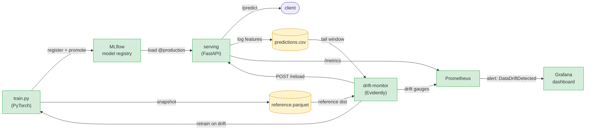

# Meridian — Model Serving & Drift Detection Pipeline

End-to-end MLOps for a NYC-taxi **trip-duration** regressor. Not "an API call to an
LLM" — this owns the full model lifecycle: train → register → serve → monitor live
traffic for **data drift** → fire an alert → **retrain and hot-reload** automatically.



<sub>The loop: train → register → serve → log live traffic → detect drift vs the training
reference → alert + auto-retrain → hot-reload serving. Closed end-to-end, no manual step.</sub>

## Stack
PyTorch (model) · MLflow (tracking + model registry) · FastAPI (serving) ·
Evidently (data drift) · Prometheus (metrics + alerting) · Grafana (dashboard) ·
Streamlit + NVIDIA NIM (god-mode drift UI with AI root-cause) · Docker Compose.

## The 2-minute demo

```bash
docker compose up --build
```

Then drive traffic from the host:

```bash
pip install httpx
python -m meridian.simulate.traffic --normal 600 --skew 800 --rps 30
# (PYTHONPATH=src if running from a checkout)
```

Open in this order and watch the loop close:

| What | URL | What you'll see |
|------|-----|-----------------|
| **Dashboard** | **http://localhost:8501** | **the front door** — flip on a blizzard, watch drift cross 0.5, have NVIDIA NIM write the root-cause, retrain and heal |
| MLflow | http://localhost:5500 | model `taxi-trip-duration` v1 with `production` alias, metrics, params |
| Serving | http://localhost:8000/docs | live `/predict`; `/metrics` for Prometheus |
| Prometheus | http://localhost:9090/alerts | `DataDriftDetected` flips **green → firing** during the skew phase |
| Grafana | http://localhost:3001 | "Meridian — Serving & Drift" dashboard, drift share crossing the red line |

> The Streamlit dashboard is now baked into `docker compose up` — it spins up at
> **:8501** alongside everything else. Set `NVIDIA_API_KEY` in your `.env` to enable
> the AI root-cause panel (it's optional; the rest of the demo runs without it).

**The money shot:** during the *normal* phase drift share sits near 0. When the
simulator switches to *skew* (rain + cold + outer-borough trips), Evidently flags
the shifted features, `meridian_data_drift_share` crosses `0.5`, Prometheus fires
`DataDriftDetected`, the monitor retrains on the new distribution, registers a new
version in MLflow, and tells serving to hot-reload it — no restart.

## How drift actually triggers
The skew is *real* covariate shift, not noise. `data.py` generates weather-impacted,
geographically wider, rush-hour-concentrated trips, so the input distributions for
`precip_mm`, `temp_c`, the lat/lon spread and `pickup_hour` move. Evidently detects
per-feature drift; once the **share of drifted features ≥ threshold** (default `0.5`)
the dataset is considered drifted. Tunable via `MERIDIAN_DRIFT_DATASET_THRESHOLD`.

## Run locally without Docker
Four terminals (or use the `Makefile` targets):

```bash
make install        # torch CPU wheels + deps
make mlflow         # 1) tracking + registry on :5500
make train          # 2) baseline model -> registered + promoted
make serve          # 3) FastAPI on :8000
make drift          # 4) drift monitor on :8001  (+ make simulate to drive traffic)
```

## Using the real dataset
The synthetic generator mirrors the NYC Taxi schema so the project runs offline.
To train on the real thing, point the trainer at a TLC/Kaggle export:

```bash
python -m meridian.train --real-csv /path/to/nyc_taxi.csv
```

Expected columns: `pickup_datetime, dropoff_datetime, passenger_count,
pickup_latitude, pickup_longitude, dropoff_latitude, dropoff_longitude`
(`temp_c`, `precip_mm` optional). Adapter lives in `data.load_real_csv`.

## Tests
```bash
make test   # data schema, scaler roundtrip, model shape, and drift detection
```
`test_drift.py` proves the core claim: baseline-vs-baseline ⇒ no drift,
baseline-vs-skewed ⇒ dataset drift.

## Layout
```
src/meridian/
  config.py            env-driven settings
  data.py              synthetic NYC-taxi generator (+ real CSV adapter, skew generator)
  model.py             PyTorch MLP + serializable scaler
  pyfunc.py            MLflow pyfunc wrapper (weights + scaler + feature order)
  train.py             train → log → register → promote
  serving/app.py       FastAPI, Prometheus metrics, prediction logging, /reload
  drift/monitor.py     Evidently loop, drift gauges, retrain trigger
  simulate/traffic.py  normal-then-skew traffic generator
prometheus/            scrape config + alert rules
grafana/               provisioned datasource + dashboard
docker-compose.yml     mlflow · trainer · serving · drift-monitor · prometheus · grafana
```
